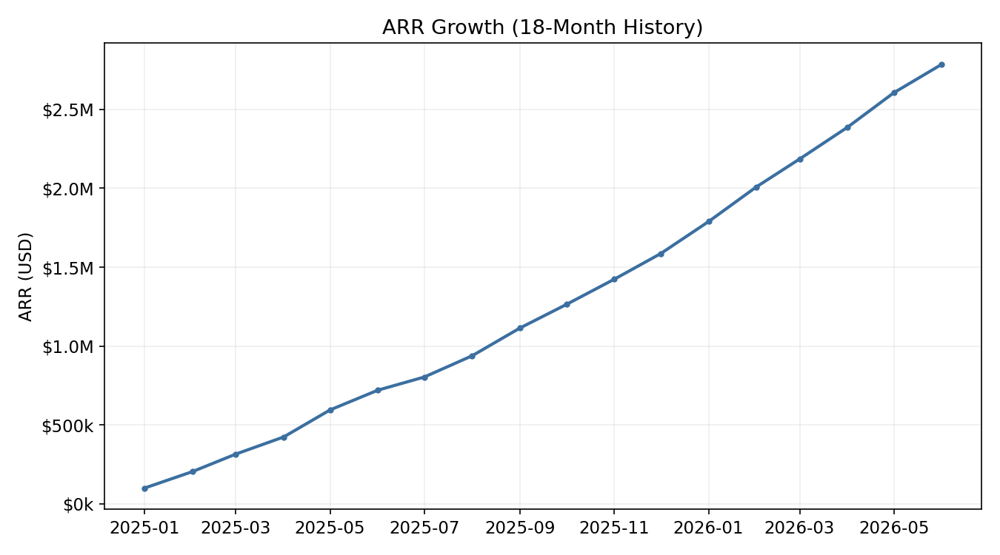
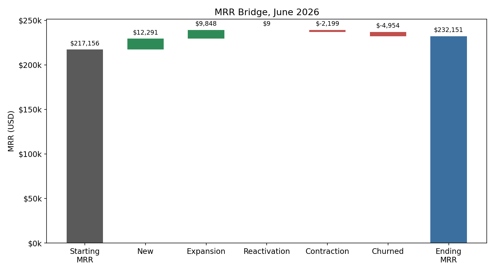
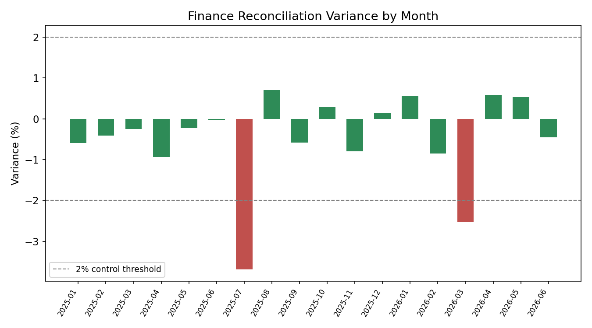
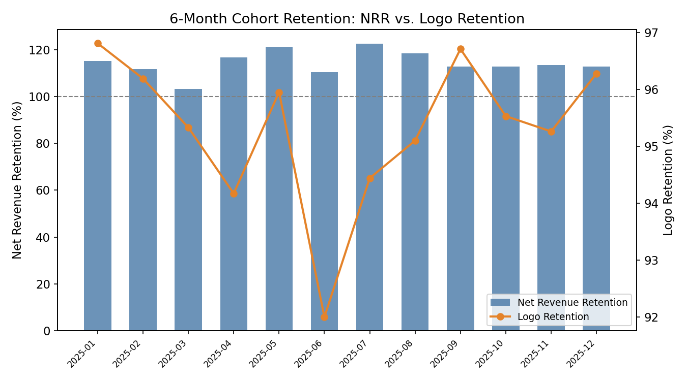

# MetricVault — Subscription Revenue Data Product

A governed, single-source-of-truth subscription revenue data product: land (Stripe) → stage → model (dbt) → certify (MetricFlow + LookML) → expose (Tableau), with a real SOX-style Finance reconciliation control. Built to mirror the analytics engineering discipline a public SaaS company's revenue data actually requires, ARR/MRR numbers that support financial reporting, not just a dashboard.

**Every pipeline stage in this repo actually runs.** This isn't illustrative SQL: `dbt build` executes for real against a local DuckDB warehouse (40/40 tests passing), and the full Dagster asset graph materializes end to end, including a live SOX control check that correctly flags two months of real variance. See verification links below.

📊 [KPI Walkthrough (PDF)](docs/kpi_walkthrough.pdf) &nbsp;|&nbsp; 🗄️ [dbt Lineage & Docs Site](dbt/target/index.html) &nbsp;|&nbsp; ✅ [Dagster Run Log (real run)](docs/dagster_run_log.txt) &nbsp;|&nbsp; 🔒 [SOX Control Docs](sox/) &nbsp;|&nbsp; 📐 [MetricFlow Semantic Layer](semantic_layer/) &nbsp;|&nbsp; 💻 [Source Code](dbt/models/)

---

## KPI Snapshot

**ARR growth, 18-month history**



**MRR bridge (the certified movement classification)**



**Finance reconciliation, the SOX control in action**



**Net Revenue Retention & Logo Retention by cohort**



---

## Problem

A subscription company's revenue metrics get defined multiple times, once in a BI tool's calculated field, once in an analyst's ad hoc SQL, once in Finance's spreadheet, and they quietly drift apart. This project builds ARR, MRR, and retention as certified, single-definition metrics that every consumer (Tableau, a legacy Looker dashboard, an ad hoc analyst) reads from the same governed source, with the one check that actually matters for a public company: does the data team's number match Finance's independently-recorded number.

## Data Source

Synthetic data shaped to mirror real Stripe API objects exactly (Customer, Subscription, Invoice, Charge, Refund, plus plan-change events), generated over an 18-month history with a documented growth/churn model: 4,503 customers, ~27,000 invoices, realistic monthly churn (~3.2%) and expansion/contraction dynamics. See `data/generate_stripe_data.py`. Finance's independently-recorded ledger is a synthetic stand-in for a NetSuite GL export, generated with deterministic (seeded) noise so reconciliation results are reproducible. See `dbt/scripts/load_raw_data.py`.

## What We're Testing For

Whether MRR movement classification (new / expansion / contraction / churned / reactivation), the genuinely hard part of subscription analytics, can be built as governed dbt logic that both a MetricFlow semantic layer and a legacy LookML layer read identically, and whether an independent Finance reconciliation catches real variance rather than always trivially passing. It does: **2 of 18 months fail the 2% control threshold**, tied to a documented one-time adjustment, not silently absorbed.

## Stack

| Layer | Tool | Why |
|---|---|---|
| Ingestion | Stripe-shaped extract, orchestrated by Dagster | Matches the target role's ingestion + orchestration stack |
| Warehouse | Snowflake (verified locally via DuckDB) | Matches the target role's warehouse; DuckDB used here so the project is runnable and testable without a live account |
| Transformation | dbt (staging → intermediate → marts) | Software-engineering discipline: version control, tests, CI, documentation |
| Semantic layer (primary) | dbt Semantic Layer / MetricFlow | Certified metric definitions, one source of truth |
| Semantic layer (secondary) | LookML | Migration-period mirror for existing Looker consumers, wired to the same certified tables |
| Orchestration | Dagster | Real asset graph: extract → build → test → semantic refresh → BI refresh, plus a SOX asset check |
| BI / consumption | Tableau | Executive-facing ARR/MRR bridge, retention cohorts, reconciliation dashboard |
| SOX compliance | Documented controls + a real reconciliation model | Access control, change management, and reconciliation, each mapped to a specific control objective |

## Task

Build the ingestion, staging, and MRR-movement-classification logic; certify ARR/MRR/NRR/logo-retention metrics in both MetricFlow and LookML from the same source tables; orchestrate the full pipeline in Dagster including a Finance reconciliation check; and document the SOX controls this design satisfies.

## Results

| Metric | Value |
|---|---|
| ARR (end of period, June 2026) | **$2,785,815** |
| MRR (end of period) | $232,151 |
| Active paying customers | 2,888 |
| Average Net Revenue Retention (6-month cohorts) | **114.3%** |
| Average Logo Retention (6-month cohorts) | 95.3% |
| Finance reconciliation | **16 of 18 months PASS** (within 2%), 2 months flagged with documented cause |
| dbt test pass rate | **40 of 40** (100%) |
| Dagster pipeline run | **RUN_SUCCESS**, full asset graph, see run log |

Full numbers in `data/computed_kpis/`.

## Data Dictionary — Certified Metrics

| Metric | dbt Model | MetricFlow | LookML | Definition |
|---|---|---|---|---|
| MRR | `fct_subscription_revenue` | `semantic_layer/metrics.yml: mrr` | `subscription_revenue.view.lkml: mrr` | Sum of active customer MRR as of the snapshot month |
| ARR | `fct_subscription_revenue` | `metrics.yml: arr` (derived, `mrr * 12`) | `subscription_revenue.view.lkml: arr` | MRR annualized, never independently defined |
| New / Expansion / Contraction / Churned / Reactivation MRR | `fct_mrr_movements` | `metrics.yml` (5 metrics) | `mrr_movements.view.lkml` | Movement-type-filtered sum of `mrr_delta` |
| Paying Customer Count | `fct_subscription_revenue` | `metrics.yml: paying_customer_count` | `subscription_revenue.view.lkml: paying_customer_count` | Distinct active customers |
| Finance Reconciliation Variance | `fct_finance_reconciliation` | `metrics.yml: finance_reconciliation_variance` | *(not mirrored, internal control only)* | Data-team ARR minus Finance's independently recorded ARR |

## Repo Structure

```
data/                          synthetic Stripe data generator + computed KPI CSVs
dbt/models/staging/            one model per Stripe object, typed + tested
dbt/models/intermediate/       MRR movement classification (the hard part)
dbt/models/marts/              certified fact/dim tables + Finance reconciliation
dbt/scripts/load_raw_data.py   loads synthetic data into DuckDB for local verification
dbt/target/index.html          generated dbt docs / lineage site (open in a browser)
semantic_layer/                MetricFlow semantic models + certified metrics
lookml/                        migration-period LookML mirror
dagster_project/assets.py      real, runnable asset graph + SOX asset check
sox/                           access control, change management, reconciliation control docs
charts/                        KPI chart generator + output PNGs
docs/                          KPI walkthrough deck (PPTX + PDF), real Dagster run log
```

## Verifying This Yourself

```bash
cd dbt
DBT_PROFILES_DIR=. dbt build      # 40/40 tests pass
DBT_PROFILES_DIR=. dbt docs generate && dbt docs serve  # opens the real lineage graph

cd ../dagster_project
dagster asset materialize -f assets.py --select "*"   # runs the full pipeline for real
```
